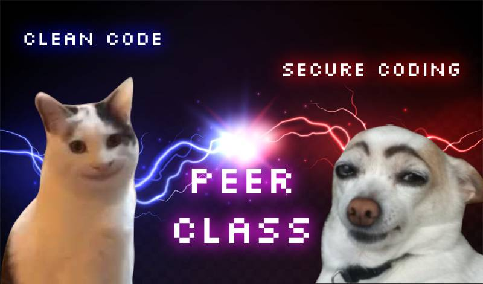
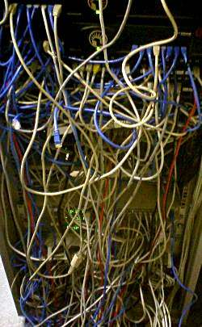

# 42 peer classes

<p align="center">
  
</p>

## Clean code

> "Clean code can be read, and enhanced by a developer other than its original author. It has unit and acceptance tests. It has meaningful names. It provides one way rather than many ways for doing one thing. It has minimal dependencies, which are explicitly defined, and provides a clear and minimal API."

All quotes are from [Clean code](https://www.goodreads.com/work/quotes/3779106-clean-code-a-handbook-of-agile-software-craftsmanship-robert-c-martin).

### Des spaghettis

<p align="center">
  
</p>

- [Wiki: Syndrome du plat de spaghettis](https://fr.wikipedia.org/wiki/Syndrome_du_plat_de_spaghettis)
- [Wiki: Programmation spaghetti](https://fr.wikipedia.org/wiki/Programmation_spaghetti)
- [Wiki: Couplage (informatique)](https://fr.wikipedia.org/wiki/Couplage_(informatique))

-> Code spaghetti == Pas lisible

### Code lisible

> "It is not the language that makes programs appear simple. It is the programmer that make the language appear simple!"  
> "Clean code is simple and direct. Clean code reads like well-written prose"

- [Wiki: Programmation modulaire](https://fr.wikipedia.org/wiki/Programmation_modulaire)
- [How to Organize Clean Architecture to Modular Patterns in 10 Minutes](https://www.codeproject.com/Articles/1210984/How-to-Organize-Clean-Architecture-to-Modular-Patt)

Code propre :
- facile à lire et à comprendre
- modulaire
- 1 fonction -> 1 action

Si vous avez dans votre programme plusieurs passages qui font la même chose (voire, un passage que vous avez copié-collé à plusieurs endroits), alors il faut en faire une fonction.

Pas bien : les fonctions super longues qui font beaucoup trop d'actions.

Quelques termes clés : modulaire, monolithe, microservice, refactoring.

Exemples :

- https://gist.github.com/davidzchen/9187984
- https://github.com/raspberrypi/linux/blob/rpi-5.4.y/fs/9p/acl.c
- https://github.com/microsoft/WSL2-Linux-Kernel/blob/master/net/ipv4/arp.c (pour ce dernier exemple, on a par ex une variable nommée `dont_send` ligne 824, qui est un nom explicite)

### Bien nommer

> "A long descriptive name is better than a long descriptive comment."

- [Naming cheatsheet](https://github.com/kettanaito/naming-cheatsheet)

Si vous ne savez pas comment nommer votre fonction ou votre variable, c'est que vous ne savez pas à quoi elle sert.

Pas bien :

- les noms pas clairs comme : n1, n2, n3
- les noms trop abrégés : env_cpy -> ecpy
- mix de mots Français-Anglais

Choisir son format et s'y tenir : camelCase, snake_case, etc. Mais aussi comment on va par exemple nommer ses fonctions, ou aussi `if (!foo)` vs `if (foo == NULL)`. 
En bref, se tenir à un format facilite la lecture.

Ne pas hésiter à faire des `define`. Il devrait y avoir le minimum de valeurs "en dur" dans le code. Les `define` permettent aussi de comprendre le programme quand on ne l'a jamais vu ou que l'on ne s'en souvient plus très bien.

Exemple : Quelques mois après avoir rendu miniRT et minishell, vais-je me souvenir à quoi correspond ce `96`, ce `39.375` ou ce `256` ? Peut-être pas. Alors :

```c
#define DEFAULT_DPI 96
#define PPM_CONV_FACTOR 39.375
#define MAX_STATES 256
```

**Exemples personnels et pour le C**

Ce sont des exemples personnels, vous gérez comme vous le sentez.

Pour les actions, j'aime bien nommer mes fonctions ainsi : `verbe_objet`
- `start_shell()`
- `trace_ray_to_objs()`
- `get_word()`

On peut faire aussi l'inverse : `objet_verbe` ou `objet_résultat`
- `str_len()`
- `str_dup()`
- `stack_increase()`

Pour les true/false : `objet_is_adjectif` ou `is_adjectif`
- `stack_is_full()`
- `stack_is_empty()`
- `input_is_valid()`

Cela clarifie la lecture :
```c
if (stack_is_full(stack))
    increase_stack(stack)
```
On comprend en lisant que si la pile est pleine, alors on augmente sa capacité.

### Bien ranger

Séparer les .h, les .c et si possible les .o dans différents dossiers.

Utiliser un fichier `.gitignore` afin de ne pas push les .o, les exécutables et d'autres fichiers pas utiles au projet comme `.DS_Store`.

Dans un fichier C :
- 1 fonction principale
- ses auxiliaires (en statique en général) qui sont rarement appelées dans d'autres fichiers
- les fonctions dans un fichier font une seule chose et travaillent ensemble

Bien nommer ses fichiers C. Si besoin, créer des subdirs.  
Ce n'est pas obligatoire de split les .h mais c'est mieux surtout pour les plus gros projets et ça permet de réutiliser des parties d'un projet à l'autre.

Exemple : si en évaluation, vous ne savez pas où retrouver une fonction, c'est que c'est mal rangé.

Pas bien : les fichiers C avec 20 000 fonctions dedans de 42 000 lignes de long.

### Méthodologie

D'abord se documenter, voire dessiner son programme, écrire des petits tests si besoin (exemple : des tests avec la mlx pour cub3D/miniRT). Savoir vers ce quoi on va même si le code va changer. Cette démarche va aussi permettre d'écrire le début des tests.

- [Flowchart In Programming](https://www.programiz.com/article/flowchart-programming)
- Flowcharts: [app.diagrams.net](https://app.diagrams.net/)

### Tester

> "It is unit tests that keep our code flexible, maintainable, and reusable. The reason is simple. If you have tests, you do not fear making changes to the code! Without tests every change is a possible bug."

- [Wiki: Test driven development](https://fr.wikipedia.org/wiki/Test_driven_development)

Plusieurs types de tests :
- **test unitaire / unit testing :** on vérifie le bon fonctionnement d'une partie précise, d'une "unité"
- **test d'intégration / integration testing :** on intègre les modules testés à l'unité et on teste l'ensemble
- **test de validation / acceptance testing :** on vérifie l'intégralité du logiciel et qu'il répond aux exigences exprimées par le client

Faites vos propres tests et automatisez-les (Github Actions, Circle CI, Travis CI...).

Il faut écrire les tests avant le programme en y allant petit à petit.

- [Unit testing with asserts](http://www.electronvector.com/blog/unit-testing-with-asserts)

## Secure coding

- [Guide ANSSI programmation en C](https://www.ssi.gouv.fr/guide/regles-de-programmation-pour-le-developpement-securise-de-logiciels-en-langage-c/)
- [Secure Coding in C and C++](https://www.pearson.com/us/higher-education/program/Seacord-Secure-Coding-in-C-and-C-2nd-Edition/PGM142190.html)

### Malloc

Quand on alloue, c'est mieux de set ensuite à zéro avec notamment bzero ou memset (utiliser ft_strnew() et ft_memalloc() par exemple).  
Quand on libère la mémoire, c'est mieux de set ensuite le pointeur à NULL (utiliser ft_strdel() et ft_memdel() par exemple).  
On ne cast normalement pas les malloc.

Il faut bien set à NULL les variables au départ.

Pas bien :
```c
if( ! ( st_cur = (struct FT_CUSTOM *) malloc(sizeof( struct FT_CUSTOM ) ) ) )
    {
        perror( "malloc failed" );
        return( 1 );
    }
```

Bien :
```c
struct FT_CUSTOM * st_cur = NULL;

st_cur = malloc( sizeof( struct FT_CUSTOM ) ); 

/* If the malloc succeeded it will have returned a valid 
 * pointer to some part of the heap, otherwise it returns 
 * NULL so we check for NULL here. */
if (st_cur == NULL) { 
    /* Print a relevant error message to stderr. */
    perror("malloc failed"); 
    /* Return a non-zero value to indicate that something failed. */
    return(1); 
}
```
